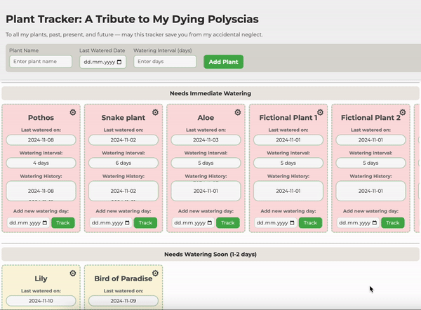

# 🌱 Plant Tracker

A simple web-based application to help you keep track of your plants and their watering schedules. 

>***Disclaimer:** This project is subject to further improvement and possible rookie naivete - any suggestions for improvement are more than welcome!*

## 🚀 Getting Started

### Prerequisites

1. `Node.js` with `npm`:

   On MacOS, you'd probably need to run:
   ```
   brew install node
   ```

   This will installs both `Node.js` and `npm`.

### Setup

1. **Clone the repo**:
   ```bash
   git clone https://github.com/anuun/plant-tracker.git
   cd plant-tracker
   ```

2. **Install dependencies** for the backend:
   ```bash
   cd backend
   npm install
   ```

### Running the App

1. **Start the server**:
   ```bash
   node server.js
   ```

   This will start the server on [http://localhost:3000](http://localhost:3000).

2. **Access the frontend**:

   You can open the local URL in a browser.


## 📝 Project Structure

```
plant-tracker/
│
├── backend/
│   ├── controllers/
│   │   └── plantsController.js   # Contains logic for managing plant data (add, update, delete, archive)
│   ├── data/
│   │   └── plants.json           # JSON file to store plant data
│   ├── routes/
│   │   └── plantsRoutes.js       # Defines the API routes for handling plants
│   ├── utils/
│   │   └── fileHelpers.js        # Utility functions for reading/writing to plants.json
│   └── server.js                 # Main entry point to start the Express server
│
├── frontend/
│   ├── index.html                # Main HTML file for the user interface
│   ├── main.js                   # JavaScript file for client-side interactions (add/update plants)
│   └── styles.css                # CSS file for styling the UI
│
└── README.md                     # (you are here)
```

## 🎥 Video Demo


